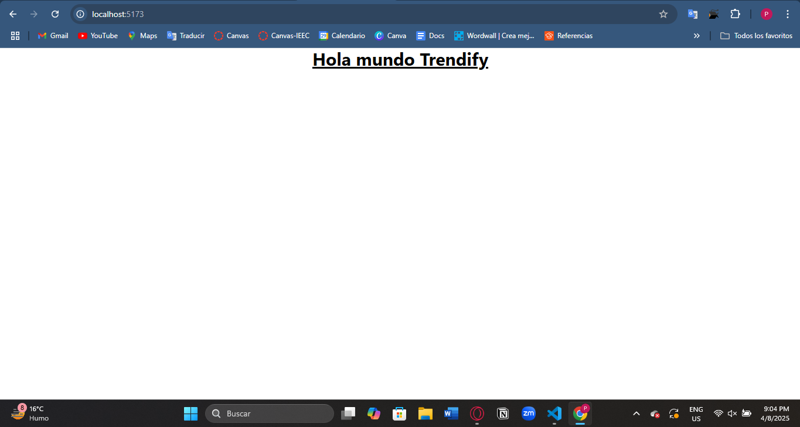

# Trendify Front-End

Este proyecto es la interfaz desarrollada con **React + Vite + Tailwind CSS**, y está pensado para ejecutarse como un frontend independiente que posteriormente se comunicará con un backend.

---

## 📦 Prerrequisitos

- Tener instalada la última versión de **Node.js**  
  👉 Recomendado: `v22.14.0`  
  Puedes verificar tu versión con:
  ```bash
  node -v

## 🚀 Pasos para instalar el proyecto
1. Abrir una terminal donde quieras clonar el repositorio.
2. Clonar el repositorio con el siguiente comando:
```bash
    git clone https://github.com/TrendifyIA/Front-end.git
```
3. Entrar al proyecto y abrir Visual Studio Code:
```bash
    cd trendify
    code .
```
4. Abrir una terminal en VS Code y ejecutar:
```bash
    npm install
```
Esto instalará todas las dependencias necesarias del proyecto.
Deberías poder ver que la app de React está lista y Tailwind CSS está funcionando correctamente.

5. Finalmente, ejecutar el proyecto en modo desarrollo:
```bash
    npm run dev
```
Esto abrirá la app en el navegador.
Deberías ver la siguiente imagen en pantalla:



## ⚠️ Consideraciones importantes
Al momento de crear archivos de componentes o páginas, usa siempre la extensión .jsx en lugar de .js.
Esto te permitirá:

- ✅ Escribir HTML directamente en los componentes
- ✅ Usar extensiones de ayuda como Emmet
- ✅ Evitar errores con className, ya que se permite usar class como en HTML

## 🌿 Ramas de trabajo
Cada persona debe trabajar en su rama correspondiente. Aquí están las asignaciones:

- Alexei
- Andy
- Sandy
- Fer
- Jenny
- Min
- Pablo
- Nacho
- Kevin
- Edu
- Yael

Para cambiar a tu rama, ejecuta el siguiente comando en la terminal:

```bash
    git checkout <Nombre de la rama>
```

Ejemplo:
```bash
    git checkout Yael
```